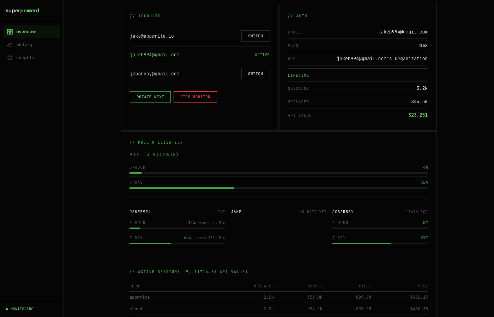
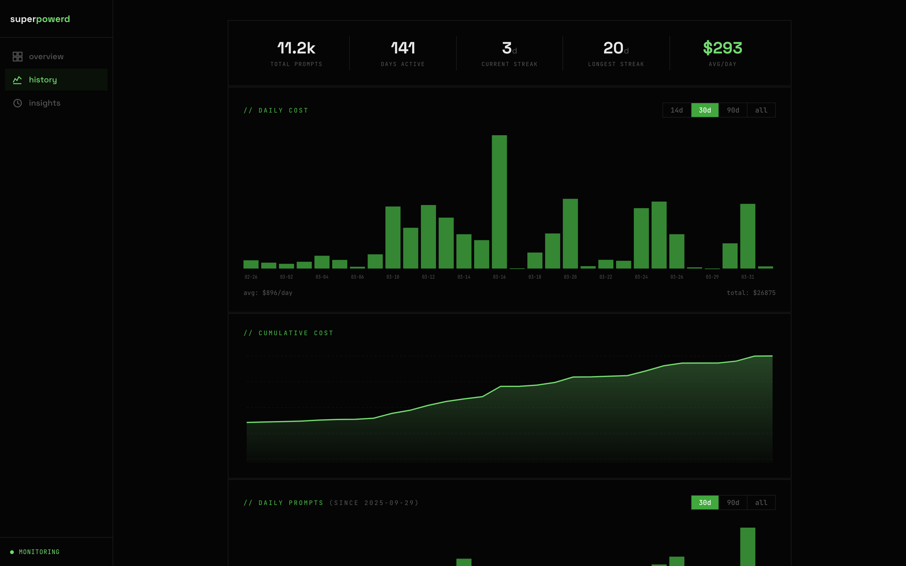
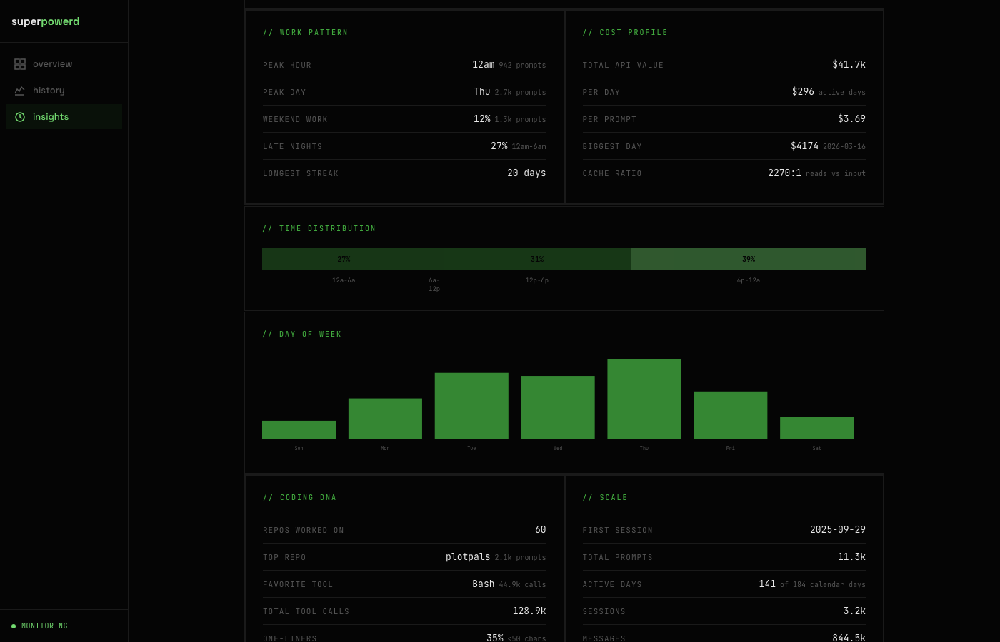

# superpowerd

Multi-account Claude Code workspace manager. Automatic rate limit detection, seamless account rotation, WezTerm multi-repo pane grid, and a real-time web dashboard. Works on macOS and Linux.







## The problem

Claude Code's Max plan has usage limits. When you hit them, you wait. If you have multiple accounts, you can rotate between them — but doing it manually means logging out of claude.ai, switching Google accounts, re-authenticating the CLI, and repeating across every terminal. Superpowerd automates all of that.

## What it does

**Account rotation** — Detects rate limits from Claude's debug logs and automatically rotates to the next account. Handles the full OAuth flow: signs out of claude.ai, signs into the next Google account, re-authenticates the CLI, and sends `/login` to every Claude terminal in your WezTerm grid. Manual rotation is a single command.

**Cookie import** — On first rotation, Playwright auto-imports Google session cookies from your real browser (Firefox or Chrome). No manual login step needed. On macOS with Chrome, it decrypts cookies via the Keychain (you'll see a one-time "allow" prompt). Firefox cookies are unencrypted and work everywhere.

**WezTerm workspace** — Reads `repos.conf` and opens a 2-column grid of terminal panes, one per repo, each running Claude Code. Pane titles show `repo · branch * · PR #123` in real-time. Global shortcuts let you jump to any pane, open/create PRs, or restart Claude.

**Dashboard** — React/TypeScript web UI at `localhost:3848` with two pages. **Overview** shows active sessions, messages, tokens, tool calls, 429 count, token TTL, account list with one-click rotation, CLI auth with lifetime stats, pool utilization bars, per-session cost breakdown by repo, activity sparklines, and a filterable live log stream. **History** shows daily cost and cumulative cost charts, daily and monthly prompt counts, a day-by-hour activity heatmap, cost by model and repo breakdowns, tool usage rankings, and streak/record stats.

**OAuth recovery** — A custom Claude Code slash command (`/auto-updater`) that walks through diagnosis and repair when the auth flow breaks.

## Quick start

```bash
git clone git@github.com:abnegate/superpowerd.git ~/Local/superpowerd
cd ~/Local/superpowerd
bash setup.sh
```

The setup script:
1. Installs Homebrew, git, gh, Node.js, Claude Code, WezTerm, and skhd
2. Copies `.example` config files and prompts you to edit them
3. Clones all repos listed in `repos.conf`
4. Installs WezTerm config, shell hooks, and skhd global shortcuts
5. Installs Playwright and its Chromium browser
6. Builds the dashboard
7. Symlinks the `/auto-updater` slash command into `~/.claude/commands/`
8. Adds `sp-rotate`, `sp-monitor`, and `sp-dashboard` aliases to `.zshrc`

After setup, restart WezTerm to activate the pane grid.

## Configuration

Three config files in the project root. All are `.gitignore`d — edit your copies freely. The `.example` files are tracked as templates.

### accounts.conf

One Claude account email per line. Accounts rotate in order.

```
alice@company.com
alice.personal@gmail.com
alice.backup@gmail.com
```

All accounts must use Google OAuth on claude.ai. Your existing browser sessions are imported automatically — no extra login needed.

### repos.conf

One repo per line. Format: `directory=org/repo`

```
myapp=myorg/myapp
backend=myorg/backend
frontend=myorg/frontend
```

`directory` is the folder name under `~/Local/`. `org/repo` is the GitHub slug used for cloning. Setup clones any repos that don't exist locally. A local shell pane is always added at the end of the grid.

### shortcuts.conf

Keyboard shortcuts for pane focus. Format: `directory=key`

```
myapp=m
backend=b
frontend=f
```

Each entry maps a repo name to `Opt+Cmd+<key>`. The local pane is always `Opt+Cmd+L`. If a repo has no entry, the first letter of its name is used.

## Usage

### Manual rotation

```bash
sp-rotate                          # Rotate to next account
sp-rotate alice.backup@gmail.com   # Switch to specific account
sp-rotate --status                 # Show current account and CLI auth state
```

What happens during rotation:
1. `claude auth logout` signs out the CLI
2. Playwright launches Chromium, imports your browser cookies, signs out of claude.ai, signs into the next Google account
3. `claude auth login` runs with a URL interceptor — Playwright captures the OAuth URL, completes the flow, and the CLI receives the callback on localhost
4. State file is updated
5. `/login` is sent to all WezTerm panes running Claude (detected by scanning pane text)
6. macOS notification (or `notify-send` on Linux) confirms the switch

### Automatic rotation

```bash
sp-monitor --daemon    # Start background watcher
sp-monitor --stop      # Stop it
sp-monitor --status    # Check if running
```

The monitor tails `~/.claude/debug/*.txt` for rate limit signals:
- HTTP 429 / 529 status codes
- "Rate limited", "usage limit", "too many requests", "overloaded", "capacity"
- Automatically switches to the newest debug log when sessions change

When a signal is detected, `sp-rotate` runs with a 5-minute cooldown between rotations. Transient 429s on the `client_data` endpoint (normal startup bursts) are filtered out.

### Dashboard

```bash
sp-dashboard    # http://localhost:3848
```

**Overview** page:
- Metrics bar: active sessions, messages, tokens, tool calls, 429 count, token TTL
- Account list with active indicator, per-account "Switch" buttons, and "Rotate Next"
- CLI auth status: email, plan, org, and lifetime totals (sessions, messages, cost)
- Pool utilization: 5-hour and 7-day usage bars per account with reset countdown
- Active sessions table: per-session cost breakdown by repo, messages, output tokens, cache
- Activity sparklines: 7/14/30-day message and token trends
- Monitor start/stop controls
- Live log stream via SSE with filters (all, rotations, limits, errors)

**History** page:
- Daily cost bar chart (14/30/90/all day ranges) with average and total
- Cumulative cost area chart
- Daily and monthly prompt counts
- Day-by-hour activity heatmap spanning all recorded history
- Cost by model table with output tokens, cache reads, and cost columns
- Top 15 tool usage breakdown
- Cost by repo horizontal bar chart and detailed repo table
- Records: longest session, duration, speculation savings
- Streak stats: current and longest active-day streaks

For development, run the Vite dev server and API server separately:

```bash
cd dashboard
npm run dev      # Frontend at :3847 (proxies /api to :3848)
npm run serve    # API server at :3848
```

### WezTerm shortcuts

| Shortcut | Action |
|----------|--------|
| `Opt+Cmd+` `` ` `` | Toggle WezTerm visibility (via skhd) |
| `Opt+Cmd+<key>` | Focus repo pane (from `shortcuts.conf`) |
| `Opt+Cmd+L` | Focus local shell pane |
| `Opt+Cmd+P` | Open current repo's PR in browser |
| `Opt+Cmd+N` | Push branch and open GitHub "compare" page |
| `Opt+Cmd+R` | Kill and restart Claude in current pane |
| `Opt+Cmd+Down` | Add a row of 2 local panes at the bottom |

Standard macOS text editing shortcuts (Opt+arrows for word nav, Cmd+arrows for line start/end, Opt+Backspace for word delete) are also configured.

### OAuth recovery

If rotation fails — stale browser session, wrong account selected, CLI stuck — use the Claude Code slash command:

```
/auto-updater
```

It runs through five recovery procedures: CLI auth reset, browser session cleanup, full credential reset, browser-auth.js selector updates (when claude.ai UI changes), and WezTerm terminal re-auth.

## How cookie import works

On the first rotation (when Playwright's persistent profile has no Google cookies), superpowerd imports session cookies from your real browser:

**Firefox** (any platform) — Copies `cookies.sqlite` from the Firefox profile directory, reads the `moz_cookies` table via `sqlite3`, filters for Google/Claude/Anthropic domains, and injects them into Playwright's browser context.

**Chrome on macOS** — Copies the `Cookies` SQLite database, reads `encrypted_value` as hex from the `cookies` table, retrieves the "Chrome Safe Storage" password from macOS Keychain (`security find-generic-password`), derives an AES-128-CBC key via PBKDF2 (salt: `saltysalt`, 1003 iterations), and decrypts each cookie. The Keychain access prompt appears once — click "Allow" or "Always Allow".

**Chrome on Linux** — Reads unencrypted cookie values directly from the `Cookies` database.

**No browser sessions** — Run `npm run browser:setup` to open Playwright's Chromium and log into your Google accounts manually. Sessions persist in `data/browser/`.

After the first import, Playwright's persistent profile stores the sessions for future rotations.

## How the OAuth URL interceptor works

`claude auth login` uses Node's `open` package to launch a browser with an OAuth URL. Superpowerd sets the `BROWSER` environment variable to a tiny shell script that writes the URL to a temp file instead of opening a browser. The rotation script polls for this file, reads the URL, and navigates Playwright to it — completing the OAuth flow in the same browser context that already has the right Google session. The OAuth callback redirects to `localhost`, which the `claude auth login` process is listening on.

## Project structure

```
superpowerd/
├── setup.sh                         # Bootstrap installer
├── package.json                     # Root deps (Playwright)
├── accounts.conf.example            # Template: Claude accounts
├── repos.conf.example               # Template: repos to open
├── shortcuts.conf.example           # Template: pane focus keys
│
├── wezterm/
│   ├── wezterm.lua                  # WezTerm config
│   │                                  Reads repos.conf + shortcuts.conf
│   │                                  Dynamic 2-column grid with tuned split ratios
│   │                                  Status bar: repo · branch · PR
│   │                                  Auto-generates skhd config on startup
│   └── pane-title.zsh               # Shell precmd hook
│                                      Updates pane titles with branch + PR info
│                                      Async PR lookup via gh, cached 5 min
│                                      Bell on commands longer than 10s
│
├── rotation/
│   ├── rotate                       # Account rotation (bash)
│   │                                  Round-robin or targeted rotation
│   │                                  Sends /login to Claude terminals via wezterm cli
│   │                                  Desktop notifications (macOS + Linux)
│   ├── monitor                      # Rate limit watcher daemon (bash)
│   │                                  Tails ~/.claude/debug/*.txt
│   │                                  5-minute cooldown between rotations
│   │                                  Auto-follows new debug log files
│   ├── browser-auth.js              # Browser automation (Playwright)
│   │                                  Auto-imports Firefox/Chrome cookies
│   │                                  Chrome Keychain decryption on macOS
│   │                                  OAuth URL interceptor via BROWSER env var
│   ├── tokens.js                    # OAuth token caching and org mapping
│   ├── index-sessions.js            # Maps Claude sessions to repos and costs
│   └── capture-hook                 # Shell hook for session event capture
│
├── dashboard/
│   ├── server.ts                    # Express API server
│   │                                  GET  /api/status       — accounts, current, monitor
│   │                                  GET  /api/auth         — claude auth status
│   │                                  GET  /api/usage        — today's stats, totals, token expiry
│   │                                  GET  /api/claude-usage — pool utilization per account
│   │                                  GET  /api/sessions     — active sessions with cost
│   │                                  GET  /api/history      — daily costs, per-repo breakdown
│   │                                  GET  /api/history-extended — prompts, heatmap, streaks
│   │                                  GET  /api/tools        — top tool usage
│   │                                  POST /api/rotate       — trigger rotation
│   │                                  POST /api/monitor/*    — start/stop
│   │                                  GET  /api/logs         — SSE log stream
│   ├── vite.config.ts               # Vite + React + proxy
│   ├── tsconfig.json
│   ├── src/
│   │   ├── main.tsx
│   │   ├── App.tsx                  # Router + state management (React 19)
│   │   ├── index.css                # Dark theme matching WezTerm
│   │   ├── pages/
│   │   │   ├── Overview.tsx         # Accounts, auth, sessions, activity, logs
│   │   │   └── History.tsx          # Cost charts, heatmap, tool usage, repos
│   │   └── components/
│   │       ├── Sidebar.tsx          # Navigation with status indicator
│   │       ├── Charts.tsx           # Sparkline, BarChart, AreaChart, tooltips
│   │       └── UsageBar.tsx         # Pool utilization bar with countdown
│   └── dist/                        # Built assets (served by Express)
│
├── commands/
│   └── auto-updater.md              # Claude Code slash command
│                                      OAuth diagnosis + recovery procedures
│
├── screenshots/                     # Dashboard screenshots for README
│
└── data/                            # Runtime state (gitignored)
    ├── state.json                   # Current account index + timestamp
    ├── session-index.json           # Session-to-repo cost mapping
    ├── tokens.json                  # OAuth tokens per account
    ├── usage-history.json           # Usage burn rate tracking
    ├── usage-snapshots.json         # Last-known usage per account
    ├── monitor.pid                  # Daemon PID
    ├── monitor.log                  # Monitor log
    ├── rotate.log                   # Rotation log
    └── browser/                     # Playwright persistent profile
```

## Requirements

- macOS or Linux
- Node.js 20+
- GitHub CLI (`gh`) — authenticated
- Playwright installs its own Chromium automatically
- skhd (macOS only, for global hotkeys — installed by `setup.sh`)

## Environment variables

| Variable | Default | Description |
|----------|---------|-------------|
| `SUPERPOWERD_HOME` | `~/Local/superpowerd` | Project root, used by wezterm.lua and shell aliases |
| `SUPERPOWERD_WORKSPACE` | `~/Local` | Directory where repos are cloned |
| `PORT` | `3848` | Dashboard server port |

## License

MIT
